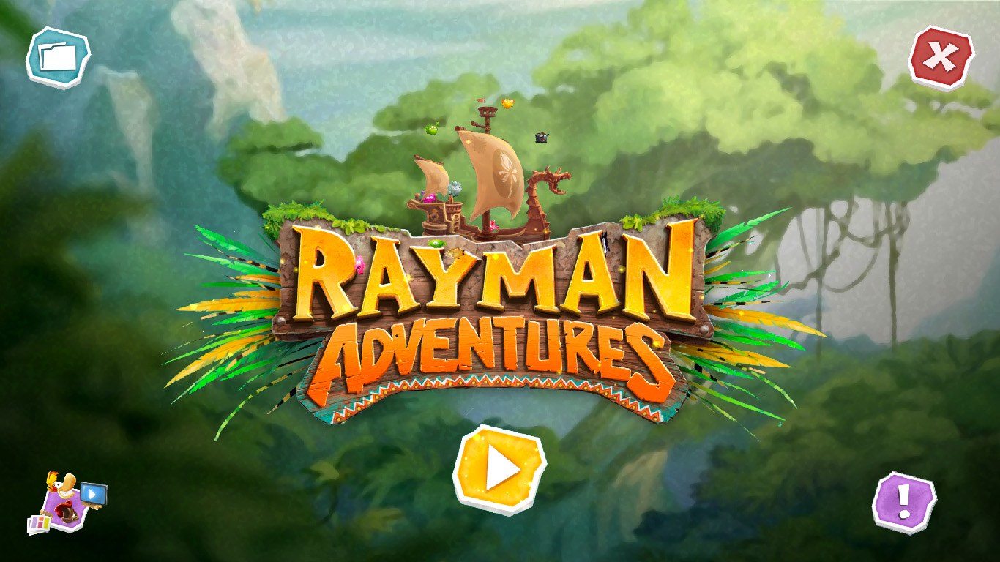
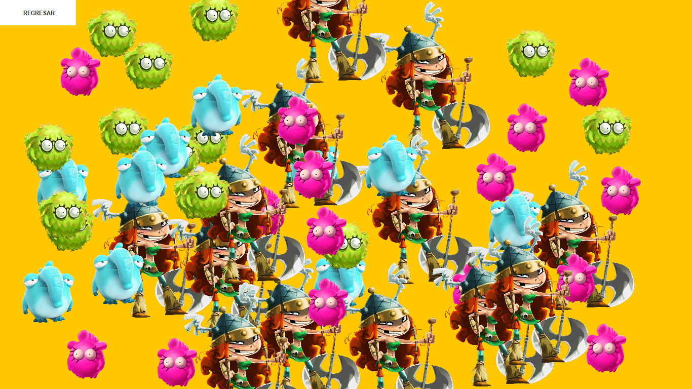
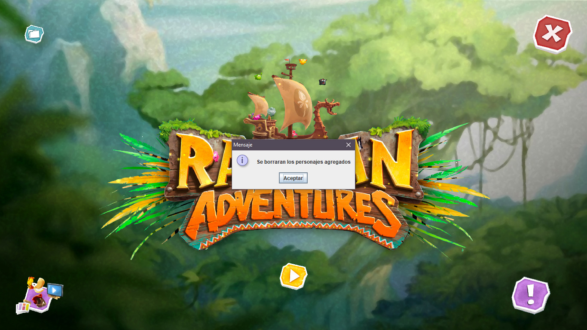

<h1>
    
    UI Inspirada en Rayman Adventure.
</h1>

Practica de Programacion Orientada a Objetos Avanzada (POOA) de diseño de interface basada en el iconico videojuego multiplataforma <a href="https://www.ubisoft.com/es-es/game/rayman-adventures/">Rayman Adventure</a> desarrollado por <a href="https://www.ubisoft.com/">Ubisoft</a>. 

El desarrollo se realizo con la herramienta de gestion de proyectos de código abierto <a href="https://maven.apache.org/">Maven</a>, se planean pruebas unitarias al tener control total del repositorio (o en su defecto se creará una copia para esto), las cuales se realizarán con <a href="https://circleci.com/">CircleCI</a>.

<h2>Capturas de la práctica</h2>

La serialización pertenece a la práctica 3.1, se dejará un enlace en dicha práctica para mencionar la serialización aplicada en esta práctica.

