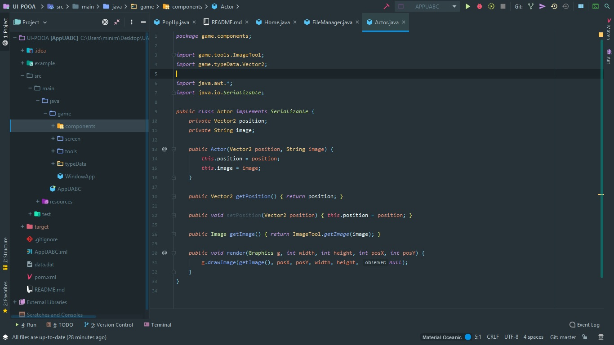

<h1>
    
    Agregar serialización a la práctica 2.1
</h1>

Se agrego la serialización en el mismo proyecto, como un nuevo commit en el repositorio <a href="https://github.com/POOA-FCQI-UABC/m2-1-crear-una-interfaz-grafica-de-usuario-Medina1402"><b>crea una interfaz gráfica de usuario</b></a>.

<h2>Aplicacion de serializacion</h2>

Se utilizo serializacion para lograr almacenar en un archivo un Vector de objetos del mismo tipo, la clase que definiria la composicion recibio el nombre de <a href="https://github.com/POOA-FCQI-UABC/m2-1-crear-una-interfaz-grafica-de-usuario-Medina1402/blob/master/src/main/java/game/components/Actor.java">Actor</a>, convencion utilizada en varios entornos para desarrollar videojuegos y/o frameworks (<a href="https://libgdx.badlogicgames.com/">libgdx</a> para JAVA).

Para lograr la serialización de imágenes se optó por solo almacenar en el Actor el nombre de la imagen a utilizar, para una imagen como tal, se debe realizar una serialización con un vector de dos dimensiones.

